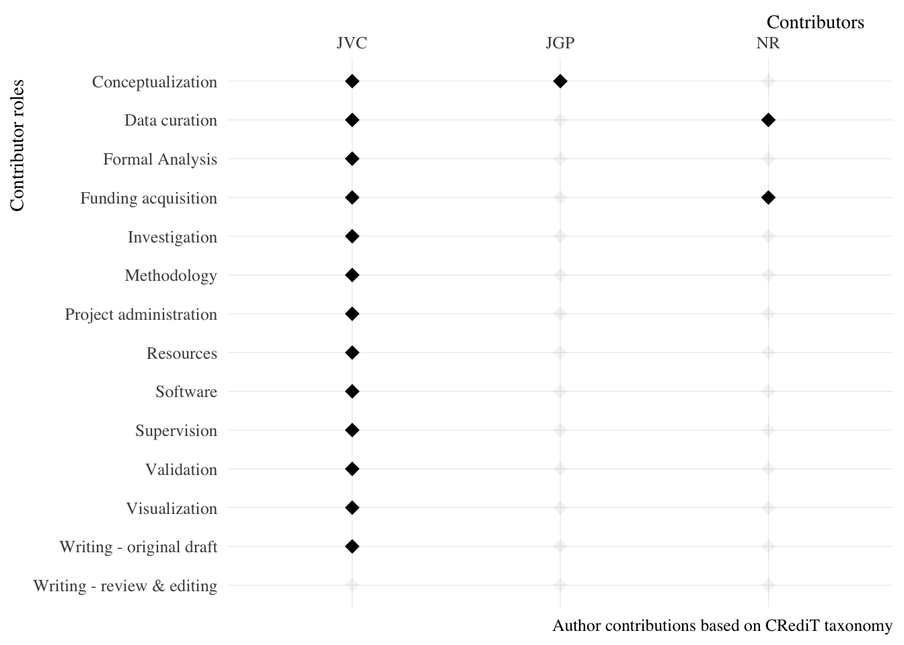

## contributoR

An R package for documenting scholarly contributions.

Last update: 2020-10-30

### Overview

The goal of contributoR is to facilitate the documentation of scholarly
contributions. This package uses the CRediT taxonomy to define
contributor roles.

### Installation

You can install the development version from GitHub with:

    install.packages("devtools")
    devtools::install_github("jvcasillas/contributoR")

### Usage

``` r
library("contributoR")

# Create example list
ex_1 <- list(
 JVC = 1:13,
 JGP = 1,
 NR  = c(2, 4))

# Plot contributions
contributor(contributions = ex_1)
```

<!-- -->

``` r
# Build list inside function
contributor(
 contributions = list(
   "Author 1" = seq(1, 14, by = 3),
   "Author 2" = c(1, 3, 5, 7, 9, 13),
   "Lazy person" = NA,
   "Advisor" = 12)
   )
```

<!-- -->
